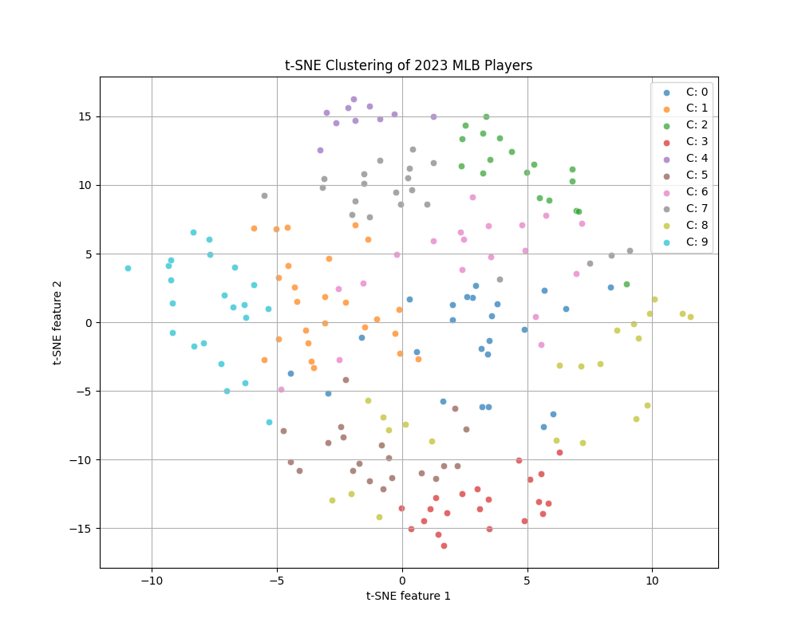

# Siloh MLB Player Clustering

For the CSCE490/492 Capstone Design Project. Classfication model utilizing an autoencoder combined with k-means clustering to categorize MLB players based on their performance statistics. An arguably old-school classification technique, but done so for the sake of lightweightness and deployability. Users can input their own statistics to find out which cluster of MLB players they most closely resemble.

## Project Structure

- `datasets/`: Contains the cleaned percentile rankings of MLB players along with the clusters they belong to.
- `models/v1/`: Holds the trained autoencoder, k-means model, and the data scaler.
- `CLI/cli.py`: The command-line interface to interact with the trained model and cluster user-input data.

## Model Overview

The model workflow can be summarized as:

1. **Autoencoder**: Trains on MLB player statistics to reduce dimensionality.
2. **k-means Clustering**: Categorizes the compressed data from the autoencoder into distinct clusters.
3. **Prediction**: The model takes user-input statistics, processes them through the autoencoder, then assigns them to one of the clusters.

## How to Use

### Ensure you have the required libraries installed. This project uses `torch`, `joblib`, `pandas`, and `sklearn`

### Clone the repository

```bash
git clone https://github.com/davwamai/siloh-clustering.git
```

### Navigate to the `CLI` directory

```bash
cd siloh-clustering/CLI/
```

### Run the command-line interface

You can re-train the model if you want, otherwise, run the cli.

```bash
python3 cli.py
```

To retrain the model:

```bash
python3 ../training/siloh_model_v1.py
```

Beware retraining if your machine does not have the option to call down to CUDA. I was able to achieve a stable MSE of 0.0001 over 1000 epochs, which can be a lot for a CPU to handle.

## t-SNE Visualization

For intuition's sake, t-SNE is a nonlinear dimensionality reduction technique well suited for embedding high-dimensional data for visualization in a low-dimensional space of two or three dimensions. Specifically, it models each high dimensional object by a two or three dimensional point such that similar objects are modeled by nearby points and dissimilar objects are modeled by distant points with high probability.

Below is the t-SNE visualization of our clustering:



## TODO

- [ ] Integrate more years of MLB data for enhanced clustering.
- [ ] Finetuning. This is a quick and dirty mock-up. The actual clustering is pretty poor, but good enough for a demo.
- [ ] Further compress the model to optimize how reactive it is in deployment.
